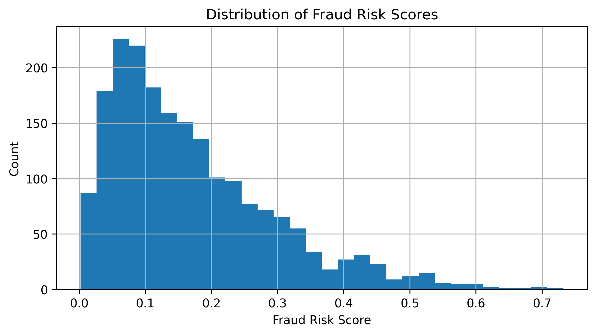
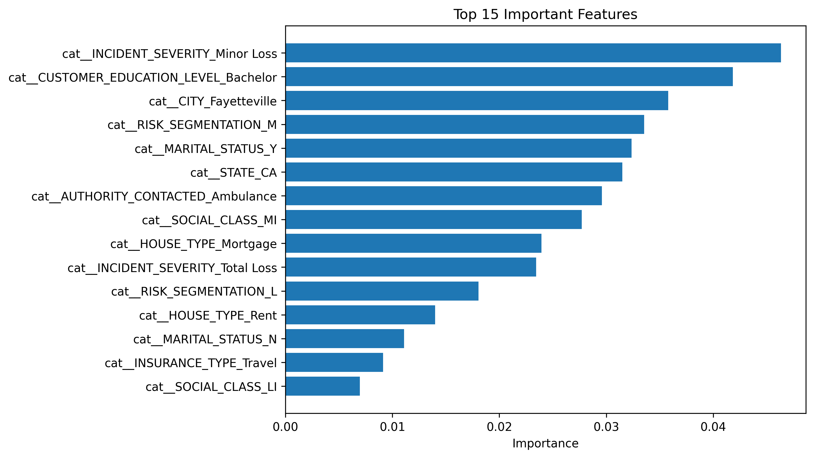
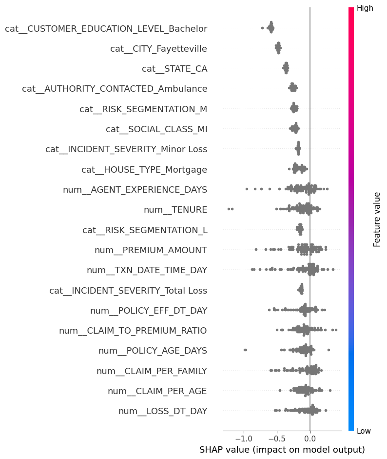

# Insurance Claim Fraud Detection & Risk Scoring

## Project Overview

This project builds a machine learning pipeline to detect suspicious insurance claims and generate fraud risk scores. The goal is to help investigators prioritize high-risk claims using data-driven insights.

The system processes insurance claim data, engineers risk features, trains a machine learning model, and visualizes results through an interactive dashboard.

---

# Business Problem

Insurance companies process thousands of claims every day. Some claims may be fraudulent, which can lead to significant financial losses.

This project aims to:

• identify suspicious claims  
• generate fraud risk scores  
• assist investigators in prioritizing investigations

---

# Dataset

The project uses three datasets:

• **insurance_data.csv** – claim information  
• **employee_data.csv** – employee and agent data  
• **vendor_data.csv** – vendor information

These datasets are merged and cleaned before model training.

---

# Project Pipeline

1. Data cleaning and preprocessing
2. Dataset merging
3. Feature engineering
4. Handling class imbalance using SMOTE
5. Model training and evaluation
6. Fraud risk scoring
7. Interactive dashboard visualization

---

# Feature Engineering

Important engineered features include:

• CLAIM_TO_PREMIUM_RATIO  
• REPORT_DELAY_DAYS  
• POLICY_AGE_DAYS  
• CLAIM_PER_AGE  
• CLAIM_PER_FAMILY  
• NIGHT_INCIDENT  
• HIGH_CLAIM_FLAG  

These features help the model detect suspicious claim behavior.

---

# Models Tested

The following models were evaluated:

• Random Forest  
• Random Forest + SMOTE  
• XGBoost + SMOTE

The final model selected was **XGBoost with SMOTE**.

---

# Model Performance

Evaluation metrics include:

• Confusion Matrix  
• Precision / Recall  
• F1 Score  
• ROC-AUC

Example results:

• Accuracy: ~0.67  
• ROC-AUC: ~0.52  
• Fraud Recall: ~0.39

---

# Fraud Risk Scoring

The model outputs a **fraud risk score** (probability of fraud) for each claim.

Claims with higher risk scores can be prioritized for investigation.

---

---

# Dashboard

A Streamlit dashboard was developed to visualize fraud risk insights.

## Dashboard Overview


---

## Fraud Risk Score Distribution



---

## Feature Importance



---

## Model Explainability (SHAP)



The SHAP summary plot explains how different features influence fraud predictions.
Features at the top have the strongest impact on the model output.
Points to the right increase fraud risk, while points to the left reduce fraud risk.
---

## Top Suspicious Claims Output

The model produces a ranked list of high-risk claims that investigators should review first.

Download the full results:

[Top Suspicious Claims Dataset](images/top_suspicious_claims.csv)


---
Run the dashboard:

```bash
streamlit run dashboard/app.py
